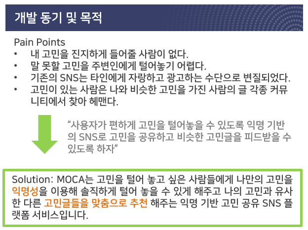
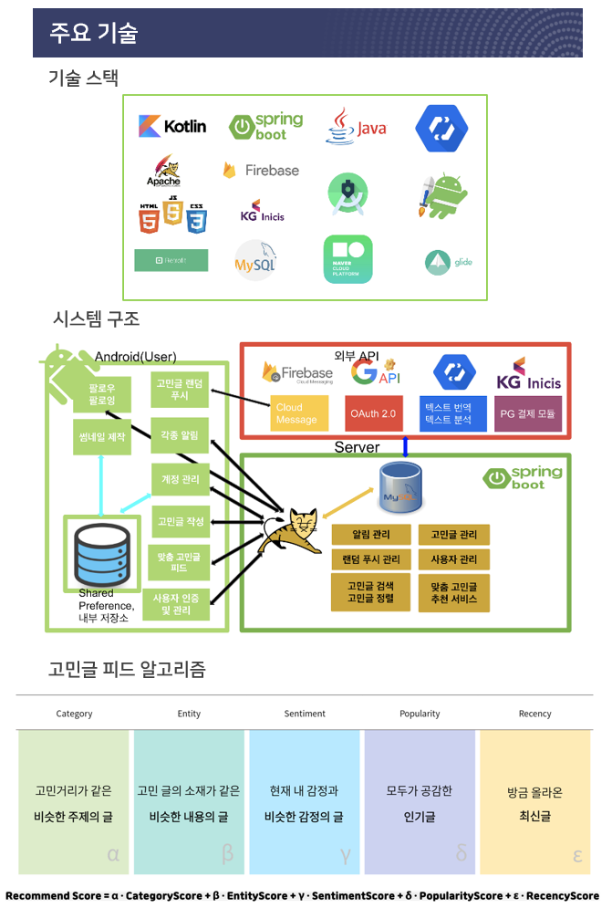
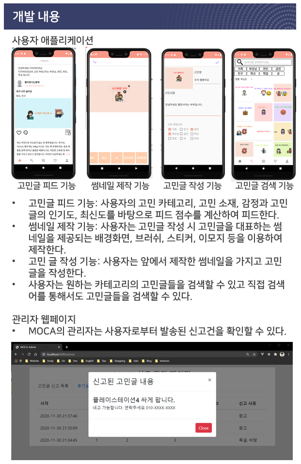
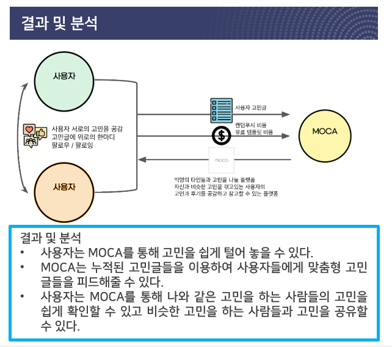
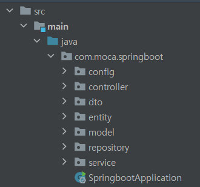

# MOCA - 고민상담 SNS

* 팀명: OppaLab
* 개발자: XXX(백엔드 개발 담당)

## Project Description









## Initial Settings Needed

* application.properties
  * Swagger URL: http://localhost:{portnumber}/swagger-ui.html, portnumber는 스프링부트포트번호
  * spring.datasource.url: jdbc connection url
  * spring.datasource.username: mysql username
  * spring.datasource.password: mysql password
  * image.thumbnail.basedir: 썸네일 이미지 저장 경로
  * image.profile.basedir: 프로필 이미지 저장 경로
  * fcm.service.account.key: firebase project admin key 파일 경로
  * spring.mail.username: 보내는 이메일 계정
  * spring.mail.password: 보내는 이메일 계정 비밀번호

* API 키파일 저장
  * google natural langugage api key 파일 저장 및 [환경변수설정](https://cloud.google.com/natural-language/docs/quickstarts)
  * firebase 프로젝트에서 Settings > 서비스 계정 > Firebase Admin SDK > 새 비공개 키 생성

## Project Structure

프로젝트 소스코드는 다음과 같이 구성된다.



* config: spring boot configuration
* controller: REST API 인터페이스
* dto: API 호출 시 넘겨주는 form-data 를 객체에 매핑
* entity: Spring Boot Data JPA 에서 사용되는 ORM 객체
* model: Service 에서 사용되는 객체 모델
* repository: JPA 에서 사용하는 table 매핑 객체
* service: controller에서 호출하는 business logic 처리

## Specification

### UserController

* ``` java
  @PostMapping("/signup")
  public Long signUp(UserDTO.SignUpRequest signUpRequest, HttpServletResponse response)
  ```
  * 회원 가입 및 인증 쿠키 발급

* ``` java
  @PostMapping("/signin")
  public Long signIn(UserDTO.SignInRequest signInRequest)
  ```
  * 로그인

* ``` java
  @PostMapping("/image/profile")
  public String setProfileImage(UserDTO.SetProfileImageRequest setProfileImageRequest)
  ```
  * 프로필 이미지 설정

* ``` java
  @PostMapping("/follow")
  public Long followUser(UserDTO.FollowRequest followRequest)
  ```
  * 팔로우

* ``` java
  @DeleteMapping("/unfollow")
  public Long unfollowUser(@RequestParam(value = "userId") long userId, @RequestParam(value = "followedUserId") long followedUserId)
  ```
  * 언팔로우

* ``` java
  @GetMapping("/profile")
  public UserDTO.GetProfileResponse getProfile(@RequestParam(value = "myUserId") long myUserId, @RequestParam(value = "userId", required = false)
  ```
  * 프로필 가져오기

* ``` java
  @GetMapping("/image/profile/{fileName}")
  public ResponseEntity<Resource> getProfileImage(@PathVariable(value = "fileName") String fileName, HttpServletRequest request) throws IOException
  ```
  * 프로필 이미지 가져오기

* ``` java
  @PutMapping("/profile/{userId}")
  public long updateProfile(@PathVariable long userId, UserDTO.UpdateProfileRequest updateProfileRequest)
  ```
  * 프로필 수정

* ``` java
    @DeleteMapping("/signout/{userId}")
    public long signOut(@PathVariable long userId)
  ```
  * 회원 탈퇴

### PostController

* ```java
  @GetMapping("/feed")
  public Page<FeedDTO.GetFeedsAtHomeResponse> getFeedsAtHome(@RequestParam(value = "userId") long userId,
  @PageableDefault(size = 30, sort = "score", direction = Sort.Direction.DESC) Pageable pageable)
  ```
  * 홈화면 피드

* ```java
  @GetMapping("/feed")
  public Page<FeedDTO.GetFeedsAtHomeResponse> getFeedsAtHome(@RequestParam(value = "userId") long userId,
  @PageableDefault(size = 30, sort = "score", direction = Sort.Direction.DESC) Pageable pageable)
  ```
  * 홈화면 피드

* ```java
  @GetMapping("/post")
  public Page<PostDTO.GetPostsResponse> getPosts(@RequestParam(value = "userId") long userId,
  @RequestParam(value = "postId", required = false) Long postId,
  @RequestParam(value = "search") String search,
  @RequestParam(value = "category") String category,
  @PageableDefault(size = 30, sort = "createdAt", direction = Sort.Direction.DESC) Pageable pageable)
  ```
  * 고민글 가져오기(내 프로필에서 고민글 보여줄때, 고민글 1개 가져올때, 검색페이지에서 사용)

* ```java
  @PostMapping("/post")
  public long createPost(PostDTO.CreatePostRequest createPostRequest) throws IOException, FirebaseMessagingException
  ```
  * 고민글 추가

* ```java
  @DeleteMapping("/post")
  public long deletePost(@RequestParam(value = "postId") long postId, @RequestParam(value = "userId") long userId)
  ```
  * 고민글 삭제

* ```java
  @PutMapping("/post/{postId}")
  public long updatePost(@PathVariable String postId, PostDTO.UpdatePostRequest updatePostRequest) throws IOException
  ```
  * 고민글 수정

* ```java
  @PutMapping("/review/{reviewId}")
  public long updateReview(@PathVariable String reviewId, PostDTO.UpdateReviewRequest updateReviewRequest)
  ```
  * 리뷰 수정

* ```java
  @GetMapping("/review")
  public PostDTO.GetReviewResponse getReview(@RequestParam(value = "userId") long userId, @RequestParam(value = "reviewId") long reviewId)
  ```
  * 리뷰 가져오기

* ```java
  @PostMapping("/review")
  public long createReview(PostDTO.CreateReviewRequest createReviewRequest)
  ```
  * 리뷰 추가

* ```java
  @DeleteMapping("/review")
  public long deleteReview(@RequestParam(value = "reviewId") long reviewId, @RequestParam(value = "userId") long userId) {
      return postService.deleteReview(reviewId);
  }
  ```
  * 리뷰 삭제

* ```java
  @GetMapping("/image/thumbnail/{fileName}")
  public ResponseEntity<Resource> getThumbnailImage(@PathVariable(value = "fileName") String fileName, HttpServletRequest request) throws IOException
  ```
  * 썸네일 이미지 가져오기

### CommentController

* ```java
  @PostMapping("/comment")
  public long createComment(CommentDTO.CreateCommentRequest createCommentRequest) 
  ```
  * 댓글 추가

* ```java
  @GetMapping("/comment")
  public Page<CommentDTO.GetCommentsResponse> getComments(@RequestParam(value = "postId", required = false) String postId, @RequestParam(value = "reviewId", required = false) String reviewId,
  @PageableDefault(size = 30, sort = "createdAt", direction = Sort.Direction.DESC) Pageable pageable)
  ```
  * 댓글 가져오기

* ```java
  @DeleteMapping("/comment")
  public long deleteComment(@RequestParam(value = "commentId") long commentId, @RequestParam(value = "userId") long userId)
  ```
  * 댓글 삭제

### LikeController

* ```java
  @PostMapping("/like")
  public Long likePost(LikeDTO.CreateLikeRequest createLikeRequest) throws FirebaseMessagingException
  ```
  * 공감하기

* ```java
  @DeleteMapping("/unlike")
  public Long unlikePost(@RequestParam(value = "postId") String postId, @RequestParam(value = "reviewId") String reviewId, @RequestParam(value = "userId") long userId)
  ```
  * 공감취소하기

### ActivityController

* ```java
  @GetMapping("/activity")
  public Page<ActivityDTO.GetActivitiesResponse> getActivities(@RequestParam(value = "userId") long userId,
  @PageableDefault(size = 30, sort = "createdAt", direction = Sort.Direction.DESC) Pageable pageable)
  ```
  * 활동알림 보기

### AdminController

* ```java
  @DeleteMapping("/deleteAccountByAdmin")
  public void deleteAccountByAdmin(@RequestParam(value = "userId") long userId) throws MessagingException
  ```
  * 관리자가 계정 삭제 조치

* ```java   
  @DeleteMapping("/deletePostByAdmin")
  public long deletePostByAdmin(@RequestParam(value = "postId") long postId) 
  ```
  * 관리자가 고민글 삭제 조치

* ```java   
  @DeleteMapping("/deleteReviewByAdmin")
  public long deleteReviewByAdmin(@RequestParam(value = "reviewId") long reviewId) 
  ```
  * 관리자가 후기글 삭제 조치

* ```java   
  @DeleteMapping("/deleteCommentByAdmin")
  public long deleteCommentByAdmin(@RequestParam(value = "commentId") long commentId) {
      commentService.deleteByComment(commentId);
      return commentId;
  }
  ```
  * 관리자가 댓글 삭제 조치

### ReportController

* ```java   
  @PostMapping("/report")
  public void report(ReportDTO.ReportRequest reportRequest) throws MessagingException
  ```
  * 고민글, 후기, 댓글 신고

* ```java   
  @GetMapping("/report")
  public Page<ReportDTO.GetReportResponse> getReports(@PageableDefault(size = 30, sort = "createdAt", direction = Sort.Direction.DESC) Pageable pageable)
  ```
  * 신고 내역 리스트

### 고민글 추천 알고리즘

고민글에 대한 RecommendationScore 계산 컴포넌트: service/FeedAlgorithmService.java

* ```java
  @Scheduled(cron = "0 0/30 * * * *")
  public void runScheduledFeedAlgorithm() {
  // 고민글 추천 로직    
  }
  ```
  * 매시 30분(필요에 따라 조절가능)마다 RecommendationScore 계산함수 실행
* ```java
  public void runFeedAlgorithmForNewUser(User user) {
  // 회원가입한 유저에 대한 고민글 추천 점수 계산
  }    
  ```
  * 회원 가입 시 선택한 고민 카테고리를 바탕으로 고민글 추천

  
  


